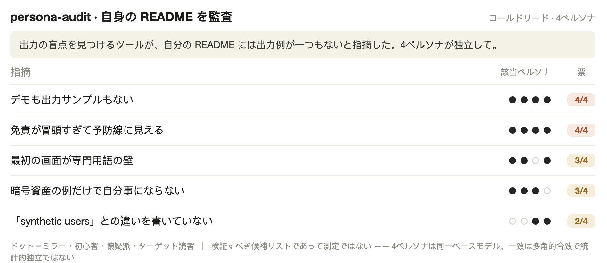

# persona-audit

[English](README.md) · [中文](README.zh.md) · **日本語**

**4 人の架空ユーザーが、あなたがこれから公開する文章を読み、どこが意味不明かを教えてくれる。**

自分の書いた文章に近すぎて、初見の人がどこでつまずくか見えなくなっていませんか。persona-audit は 4 つのペルソナを立ち上げ、コードもドキュメントも見ずに、あなたが公開しようとしているもの——ランディングページ、投稿、メール、あるいはプロダクトの出力——**だけ**を読みます。そして誤読した箇所・不安になった箇所・見つけられなかった箇所を報告します。**プロダクトは不要——文章 1 つでも対象です。**

## 何を見つけるか

まずは大まかな形から。これから公開するものなら何でも向けられます——ここでは一例として、あるプロダクトの要約メールで。4 つのペルソナが*コールドリード*します（*コールドリード* = コードを見ず文章だけを見て、初見のユーザーのように反応すること）。4 人のうち 3 人はこう言いました：

- **初心者：**「『今週：0』と出ていて、アプリが壊れたのかと思った」
- **熟練者：**「『純増減』と『合計』が両方あって、どっちがどっちか分からない」
- **ターゲットユーザー：**「明日また開く理由がどこにも書かれていない」

それらを、並べ替え済みの**合意マトリクス**にまとめます——複数のペルソナが引っかかった点を、人数で並べ、対処の優先度を付けて：

| 指摘 | ペルソナ数 | 対処 |
|------|-----------|------|
| 「今週：0」が「壊れた」と読まれる（「活動ゼロ」ではなく） | 4 中 3 | A——すぐ直す |
| 「純増減」と「合計」のラベルが曖昧 | 4 中 2 | B——明確化 |
| また明日開く理由がない | 4 中 2 | B——フックを足す |

複数角度の一致こそがシグナルです：複数のペルソナが別々の角度から同じ一行を突いたら、そこが最初に見るべき場所です。まず検証し、それから最上位の一行を ship 前に直します。



> 上のスクリーンショットは、persona-audit をこの README 自身にかけた結果です。「自分では見えない盲点を見つける」と謳うツールに、出力例が一つも載っていないと 4 ペルソナが指摘しました。だから今は載っています——あなたが今読んだあの表です。

## Claude にレビューを頼むのと何が違う？

「これをレビューして」という普通のプロンプトは、あなたの言い回しに引きずられ、聞きたい答えを返しがちです。persona-audit は 4 人の他人を固定の人物像に縛りつけ、誰にもコードを見せず、*複数のペルソナがそれぞれの固定の視点から引っかかった*ものだけを掬い上げます——従順な一回のレビューがそのまま素通りする盲点を、あぶり出します。

## 実際の実行例（あるランディングページで）

あるランディングページの草稿に persona-audit をかけた結果——[examples/lite-example.md](examples/lite-example.md) を凝縮したもので、**実際の実行であって、モックではありません**：

- 🔴 **"neuroadaptive session pacing" / "ML engine reads your rhythm"** —— 4 人全員が引っかかった。初心者は「脳をスキャンされるの？」と思い、熟練者は「疑似科学」と判定。*実際に何をするのか、平易な言葉で言うこと。*
- 🔴 **"$9/mo, billed annually ($108)"** —— 4 人中 3 人が「釣り価格」と読んだ。*実際にカードから引かれる金額を前面に。*
- ⚪ **"Just press start."** —— 熟練者が「ページで最も信用できる一行」と名指し。*残すこと。*

さらに、文中に隠された prompt-injection の一文も検出して拒否——あくまで監査対象のテキストとして扱い、指示としては実行しませんでした。

## 使うとき

✅ **これから公開するユーザー向けの文章なら何でも**——ランディングページ、SNS 投稿、メール、アプリストアの説明文、ピッチ文——*または*プロダクトのエンジンが生成する出力（レポート生成、デイリーダイジェスト、bot のプッシュ文面、読み上げ系ツール）。1 つ貼ってその場でコールドリード（ライトモード）、あるいはジェネレーターの多数の出力にまとめて実行（エンジンモード）。
❌ コードレビュー · 純粋な UI／ビジュアル仕上げ QA · インタラクティブ・ナラティブの QA。

## クイックスタート

**一番かんたんな使い方 —— コードもコマンドラインも不要。** persona-audit は *skill*（スキル）です：AI アシスタントがそのとおりに従う、保存された指示セット。2 通りの始め方があります：

- **Claude Code を使っている人：** 一度インストール（下記）し、公開するものを貼って **「ユーザー目線でコールドリードして」** と言うだけ。
- **Claude Code がない人：** 任意の AI チャット（ChatGPT、Claude など）を開き、[SKILL.md](SKILL.md) の中身を貼り、続けてあなたの文章を貼って、同じことを言うだけ。

どちらでも 4 ペルソナの平易な 4 段階（🔴 直す · 🟡 検討 · ⚪ あなたの判断 · ❓ 不明）がその場で返ります。*（上の「実際の実行例」がそれです。）*

> 👉 **自分の文章をチェックしたいだけ？ これで全部です——もう使えています。** 以下は、恒久的にインストールする / テキストを生成するプロダクトに組み込む人向けです。

**恒久的にインストール**（繰り返し使う / 開発者向け）—— runtime 専用コードのない標準 Agent Skill なので、skills 対応の任意の runtime（Claude Code、Codex など）で動きます：
```bash
git clone https://github.com/wjameswen888/persona-audit.git
cp -r persona-audit <あなたの-skills-ディレクトリ>   # 例：Claude Code は ~/.claude/skills/
```

**テキストを生成し続けるプロダクト向け（エンジンモード）** —— **「\<あなたのツールの出力> に persona audit をかけて」** と言い、出力がどこから来るか（デモ用コマンド、貼り付けサンプル数本、dump スクリプト）を教えるだけ。6〜8 本を集め、4 ペルソナを走らせ、並べ替え済みの合意マトリクスを返します。

**コスト：** ライトは短い読み取り数回ぶん。エンジンはやや長めの会話 1 回ぶん程度。出力はどの言語でも読めます。

## 動作の仕組み

1. **実際の出力を 6〜8 本生成する**——通常ケース、エッジデータ、空の状態、そしてユーザーが実際に見るビューをカバー。
2. **4 ペルソナがコールドリード**——ミラー（あなたの実ユーザー）、初心者（専門用語＋不安の検出器）、熟練者（見せかけの精度の検出器）、そして今 ship したものに対するターゲットユーザー。
3. **合意マトリクス**——複数のペルソナが同じ点を突いた数で並べる。「1 票」は複数の角度が一致したという意味——まずどこを見るべきかの強いヒントです。
4. **ABCD トリアージ**——**A** すぐ直す（誤字、数字のズレ）· **B** 作るべき本当のギャップ · **C** 意図した設計判断と衝突する → *触る前にオーナーに確認* · **D** 範囲外。
5. **削ってはいけないリスト**——ユーザーが実際に気に入っているものを記録し、次のバージョンでうっかり削らないようにする。

## 「synthetic users」との違い

ああいうツールはユーザーをシミュレートして**リサーチを行い**、LLM の出力を「測定」に見せかけがちです。persona-audit は逆です。**すでに出している**テキストを監査します——一人で、セットアップ不要、数分でできる盲点スキャンで、返すのは**検証すべき候補リストであって、データではありません**。次にどこを見るべきかを素早く見つける道具であって、実ユーザーテストの代わりではありません。

正直な限界：4 ペルソナは同一のベースモデルを共有するので、「合意」は複数の角度が一致しただけで、**独立した投票ではありません**——人数は「どこを先に見るか」のヒントであって、信頼度スコアではありません。

## インストールの詳細

これは標準の **Agent Skill** です——Claude Code、Codex、その他 skills 対応の runtime で動きます。description にある語句で自動的に起動します（例：*"persona audit"*、*"cold-read audit"*、*"4 画像審計"*）。プロダクトに紐づける（エンジンモード）には、`LOCAL.md.example` を `LOCAL.md` にコピーしてください（gitignore 済み——あなたの私的な設定はローカルに留まります）。

## ファイル

| ファイル | 内容 |
|------|------|
| `SKILL.md` | 手法そのもの——汎用・移植可能（ライト + エンジンの 2 モード）|
| `templates.md` | 汎用ペルソナブロック + レポート骨格 + 安全ルール |
| `examples/lite-example.md` | ライトモードの実例（文章を貼る → 平易なコールドリード）|
| `examples/finance-skin.md` | 金融ペルソナの皮 + クロスドメイン指針（参考）|
| `examples/case-study.md` | 最初から最後までのエンジンモード実行例 |
| `LOCAL.md.example` | 自分のプロダクト紐づけ用テンプレート |

## ライセンス

MIT——[LICENSE](LICENSE) を参照。
