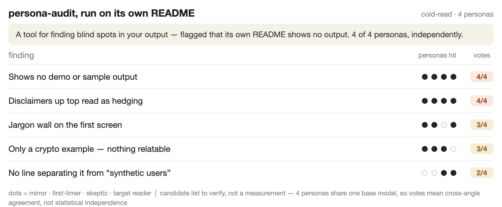

# persona-audit

**English** · [中文](README.zh.md) · [日本語](README.ja.md)

**Four fake users read what you're about to publish — and tell you what makes no sense.**

You're too close to your own words to see where a stranger gets stuck. persona-audit spins up four personas who read *only* the thing you're publishing — a landing page, a post, an email, or your product's output — never the code, never the docs — and report what they misread, panic at, or can't find. **No product required — a single piece of copy counts.**

## What it catches

Here's the shape of it. Point it at anything you publish — here, a product's daily digest. Four personas read it *cold* (only the words, never your code), reacting like true first-timers. Three of the four said:

- **Novice:** "It says *This week: 0* — I thought the app was broken."
- **Veteran:** "*Net change* and *total* are both here and I can't tell which is which."
- **Target user:** "Nothing tells me why I should open this tomorrow."

It collapses those into a ranked **consensus matrix** — what several personas land on, scored by how many, triaged for action:

| Finding | Personas | Action |
|---------|----------|--------|
| "This week: 0" reads as *broken*, not *zero activity* | 3 of 4 | A — fix now |
| "Net change" vs "total" are unlabeled and ambiguous | 2 of 4 | B — clarify |
| Nothing earns the next open | 2 of 4 | B — add a hook |

Cross-angle agreement is the signal: when several personas land on the same line from different angles, that's where to look first. You verify, then fix the top one before it ships.



> That screenshot is persona-audit run on *this README*: four personas flagged that a tool about "seeing your own blind spots" had no demo of its own. So now it has one — the table you just read.

## Why not just ask Claude to review it?

A plain "review this" prompt tends to follow your wording and tell you what you hoped to hear. persona-audit pins four strangers to fixed identities, lets none of them see your code, and surfaces only what *several of them flag from different fixed angles* — so it catches the blind spots a single, agreeable pass glides right over.

## A real run (on a landing page)

persona-audit on a draft landing page — condensed from [examples/lite-example.md](examples/lite-example.md), **a real run, not a mock-up**:

- 🔴 **"neuroadaptive session pacing" / "ML engine reads your rhythm"** — all four bounced off it; the novice thought it meant a brain scan, the veteran called it pseudo-science. *Say in plain words what it actually does.*
- 🔴 **"$9/mo, billed annually ($108)"** — three of four read it as a bait price. *Lead with the number that hits the card.*
- ⚪ **"Just press start."** — the veteran flagged it as the most credible line on the page. *Keep it.*

It also caught a prompt-injection line hidden in the copy and refused it — treating it as text to audit, never an instruction to follow.

## When to use

✅ **Anything user-facing you're about to publish** — a landing page, social post, email, app-store blurb, pitch line — *or* a product engine's generated output (report generators, daily digests, bot push copy, readout tools). Paste one piece for an inline read (lite mode), or run it across a generator's many outputs (engine mode).
❌ Code review · pure UI/visual polish QA · interactive-narrative QA.

## Quickstart

**The easy way — no code, no command line.** persona-audit is a *skill*: a saved instruction set your AI assistant follows. Two ways to get there:

- **Have Claude Code?** Install it once (below), then paste what you're publishing and say **"cold-read this from a user's POV."**
- **No Claude Code?** Open any AI chat (ChatGPT, Claude, etc.), paste in the contents of [SKILL.md](SKILL.md), then your copy, and say the same thing.

Either way you get four personas' plain-language fixes (🔴 fix · 🟡 consider · ⚪ your call · ❓ unsure), inline. *(That's the "real run" above.)*

> 👉 **Just checking your copy? That's the whole thing — you're done.** Everything below is for installing it permanently or wiring it into a product that generates text.

**Install permanently** (repeat use / developers) — it's a standard Agent Skill with no runtime-specific code, so it runs in any skills-compatible runtime (Claude Code, Codex, and others):
```bash
git clone https://github.com/wjameswen888/persona-audit.git
cp -r persona-audit <your-skills-dir>   # e.g. Claude Code: ~/.claude/skills/
```

**For a product that generates text (engine mode)** — say **"run a persona audit on \<your tool's output>"** and point it at where the outputs come from (a demo command, a few pasted samples, or a dump script). It gathers 6–8, runs the four personas, and returns the ranked consensus matrix.

**Cost:** a lite run is a handful of short reads; an engine run ≈ one longer chat's usage. Reads output in any language.

## How it works

1. **Generate 6–8 real outputs** — cover normal cases, edge data, empty states, and the view users actually see.
2. **Four personas cold-read them** — mirror (your real user), novice (jargon + panic detector), veteran (false-precision detector), and a target for whatever you just shipped.
3. **Consensus matrix** — findings ranked by how many personas land on the same thing. A "vote" means several prompt-angles converged — a strong hint of where to look first.
4. **ABCD triage** — **A** fix now (typos, wrong numbers) · **B** real gaps to build · **C** conflicts with a deliberate design choice → *ask the owner before touching it* · **D** out of scope.
5. **Don't-cut list** — what users actually loved, flagged so you don't break it next version.

## How it differs from "synthetic users"

Those tools simulate users to *do research*, and often dress LLM output up as a measurement. persona-audit does the opposite: it audits the text you **already ship** — a single-person, zero-setup, few-minute blind-spot scan that hands you a **candidate list to verify, not data**. A sharp way to find what to look at next, not a substitute for testing with real users.

Honest limit: the four personas share one base model, so a "consensus" is several angles converging, **not independent votes** — treat the counts as a heuristic for *where to look*, not a confidence score.

## Install details

It's a standard **Agent Skill** — runs in Claude Code, Codex, and other skills-compatible runtimes; auto-triggers on the phrases in its description (e.g. *"persona audit"*, *"cold-read audit"*, *"audit this from a user's POV"*). To bind it to a product (engine mode), copy `LOCAL.md.example` → `LOCAL.md` (gitignored — your private bindings stay local).

## Files

| File | What |
|------|------|
| `SKILL.md` | The method — generic, portable (lite + engine modes) |
| `templates.md` | Generic persona blocks + report skeletons + safety rules |
| `examples/lite-example.md` | Lite-mode worked example (paste copy → plain-language read) |
| `examples/finance-skin.md` | Finance persona skins + cross-domain guide (reference) |
| `examples/case-study.md` | A real engine-mode run, start to finish |
| `LOCAL.md.example` | Template for your private product bindings |

## License

MIT — see [LICENSE](LICENSE).
