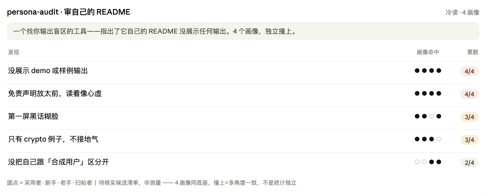

# persona-audit

[English](README.md) · **中文** · [日本語](README.ja.md)

**四个假用户，读你给真用户看的文字，告诉你哪句不通。**

你太懂自己的产品，看不见陌生人卡在哪。persona-audit 派四个画像，**只读**你工具输出的文字——不碰代码、不看文档——报告他们读错了什么、被什么吓到、找不到什么。

## 它能抓到什么

拿你 app 每天发给用户的那条简报举例。四个画像*冷读*同一条真实简报——*冷读* = 只看输出、不看代码，像真用户第一次见那样反应：

- **新手：**"上面写'本周：0'，我以为 app 坏了。"
- **老手：**"'净变化'和'总计'都在，我分不清哪个是哪个。"
- **目标用户：**"没有一句告诉我明天为什么还要点开它。"

它把这些收成一张排好序的**共识矩阵**——几个画像各自撞上的点，按撞上的人数排序、并标好怎么处置：

| 发现 | 画像数 | 处置 |
|------|--------|------|
| "本周：0" 被读成"app 坏了"，而不是"本周无活动" | 4 中 3 | A——立刻修 |
| "净变化"和"总计"没标清、容易混 | 4 中 2 | B——补说明 |
| 没有一句让人明天还想点开 | 4 中 2 | B——加个钩子 |

跨角度撞上同一处，就是信号——不过四个画像共用同一个底层模型，所以这是"几个角度都觉得别扭"，不是互相独立的投票。你先核实，再把最前面那条在发布前改掉。



> 上面这张图，就是 persona-audit 跑在这份 README 上的结果：四个画像各自指出，一个讲"帮你看见自己盲区"的工具，自己却没有一个 demo。所以现在有了——就是你刚读的那张表。

## 凭什么不是直接让 Claude review 一下就够了

一句"帮我看看"的 prompt，往往顺着你的措辞、说你想听的话。persona-audit 把四个陌生人钉死在固定身份、谁都不许看你的代码，只捞出*几个画像各自撞上*的同一处——这些正是一次顺从的 review 会直接滑过去的盲区。

## 什么时候用

✅ 一个**引擎产出用户向文本**的工具，发布了新版本或新的输出层——报告生成器、每日简报、bot 推送文案、读数工具。*（对，一个每天给用户发总结的副业小程序也算。）*
❌ 代码 review · 纯 UI/视觉 QA · 交互叙事 QA。

## 快速上手

**安装** —— 把这两行贴给 Claude，让它帮你装好：
```bash
git clone https://github.com/wjameswen888/persona-audit.git
cp -r persona-audit ~/.claude/skills/
```

**跑起来** —— 对 Claude 说 **"对 \<你工具的输出> 跑一次 persona audit"**，再告诉它这些输出从哪来（一条演示命令、几条粘贴的样本、或一个临时导出脚本）。它会凑齐 6–8 份、跑完四个画像，几分钟后把排好序的矩阵交给你。起步不用任何配置；`LOCAL.md` 用来绑定你的产品，但每个钩子都有默认值。它能读任何语言的输出，跑在你现有的 Claude Code 上——不用额外订阅，一次的开销大约相当于一次稍长的对话。

## 怎么跑

1. **生成 6–8 份真实输出**——覆盖普通情况、边缘数据、空状态、用户真正看到的那个视图。
2. **四个画像冷读**——镜像（你的真实用户）、新手（黑话+恐慌探测器）、老手（假精度探测器）、以及你刚发布的那层的目标用户。
3. **共识矩阵**——按几个画像各自撞上同一处的数量排序。"一票"意味着几个角度都觉得别扭——是"先看哪里"的强提示。
4. **ABCD 分层**——**A** 立刻修（错别字、数字错位）· **B** 要做的真 gap · **C** 跟某个刻意的设计选择冲突 → *动手前先问 owner* · **D** 边界外。
5. **别砍清单**——用户真正喜欢的东西，标出来，免得下版本顺手砍了。

## 跟"合成用户"有什么不一样

那些工具模拟用户去**做调研**，还常把 LLM 输出包装成"测量"。persona-audit 反过来：它审你**已经在发**的文字——一个单人、零成本、几分钟的盲区扫描，给你一份**待核实的候选清单，不是数据**。它是帮你快速找到"下一个该看哪"的利器，不是真人测试的替代品。

## 安装细节

这是个 [Claude Code skill](https://docs.claude.com/en/docs/claude-code)——按描述里的触发词自动触发（比如 *"persona audit"*、*"冷读审计"*、*"4 画像审计"*）。想绑定你的产品，把 `LOCAL.md.example` 复制成 `LOCAL.md`（已 gitignore，你的私有绑定只留在本地）。

## 文件

| 文件 | 是什么 |
|------|--------|
| `SKILL.md` | 方法本体——通用、可移植 |
| `templates.md` | 4 个画像身份块 + 报告骨架 + 跨域适配 |
| `examples/case-study.md` | 一场从头到尾的真实运行 |
| `LOCAL.md.example` | 你私有产品绑定的模板 |

## 许可

MIT——见 [LICENSE](LICENSE)。
